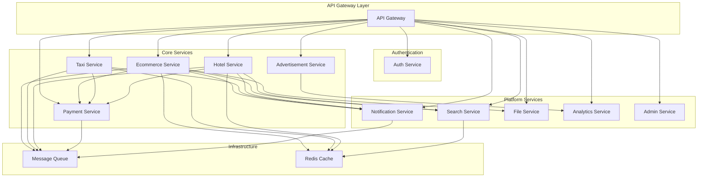

# Service Architecture

## Overview

This document provides detailed architecture information for each service in the multi-service platform, including their responsibilities, interfaces, data models, and interaction patterns.

## Service Interaction Diagram



## Service Details

### API Gateway

**Purpose**: Central entry point for all client requests

**Technology Stack**:
- Kong or Nginx
- Rate limiting middleware
- Authentication middleware
- Load balancing

**Key Responsibilities**:
- Request routing based on URL patterns
- Authentication token validation
- Rate limiting and throttling
- Request/response transformation
- Load balancing across service instances
- API versioning support
- Monitoring and metrics collection

**Configuration**:
```yaml
routes:
  - path: /auth/*
    service: authentication-service
    port: 3001
  - path: /ecommerce/*
    service: ecommerce-service
    port: 3003
  - path: /taxi/*
    service: taxi-service
    port: 3004
  - path: /hotels/*
    service: hotel-service
    port: 3005
```

**Health Check**: `GET /health`
**Metrics**: Request count, response time, error rates per service

---

### Authentication Service

**Purpose**: Centralized user authentication and authorization

**Technology Stack**:
- Node.js + Express.js
- JWT for token management
- bcrypt for password hashing
- PostgreSQL for user data

**Database Schema**:
```sql
-- Users table
CREATE TABLE users (
    id UUID PRIMARY KEY DEFAULT gen_random_uuid(),
    email VARCHAR(255) UNIQUE NOT NULL,
    password_hash VARCHAR(255) NOT NULL,
    first_name VARCHAR(100) NOT NULL,
    last_name VARCHAR(100) NOT NULL,
    phone VARCHAR(20),
    roles TEXT[] DEFAULT ARRAY['user'],
    is_email_verified BOOLEAN DEFAULT FALSE,
    is_phone_verified BOOLEAN DEFAULT FALSE,
    created_at TIMESTAMP DEFAULT NOW(),
    updated_at TIMESTAMP DEFAULT NOW()
);

-- Sessions table
CREATE TABLE user_sessions (
    id UUID PRIMARY KEY DEFAULT gen_random_uuid(),
    user_id UUID REFERENCES users(id) ON DELETE CASCADE,
    refresh_token VARCHAR(500) NOT NULL,
    expires_at TIMESTAMP NOT NULL,
    created_at TIMESTAMP DEFAULT NOW()
);
```

**Key APIs**:
- `POST /register` - User registration
- `POST /login` - User authentication
- `POST /logout` - Session termination
- `POST /refresh` - Token refresh
- `GET /profile` - User profile
- `PUT /profile` - Update profile
- `POST /verify-token` - Token validation (internal)

**Events Published**:
- `user.registered` - New user registration
- `user.login` - User login event
- `user.profile.updated` - Profile changes

**Security Features**:
- Password strength validation
- Account lockout after failed attempts
- JWT with short expiration + refresh tokens
- Multi-factor authentication support
- OAuth2 integration (Google, Facebook, Apple)

---

### Ecommerce Service

**Purpose**: Product catalog, shopping cart, and order management

**Technology Stack**:
- Node.js + Express.js
- PostgreSQL for transactional data
- Redis for cart session storage
- Integration with Payment Service

**Database Schema**:
```sql
-- Categories
CREATE TABLE categories (
    id UUID PRIMARY KEY DEFAULT gen_random_uuid(),
    name VARCHAR(255) NOT NULL,
    description TEXT,
    parent_id UUID REFERENCES categories(id),
    image_url VARCHAR(500),
    is_active BOOLEAN DEFAULT TRUE,
    created_at TIMESTAMP DEFAULT NOW()
);

-- Products
CREATE TABLE products (
    id UUID PRIMARY KEY DEFAULT gen_random_uuid(),
    name VARCHAR(255) NOT NULL,
    description TEXT NOT NULL,
    price DECIMAL(10,2) NOT NULL,
    currency VARCHAR(3) DEFAULT 'USD',
    category_id UUID REFERENCES categories(id),
    vendor_id UUID NOT NULL,
    sku VARCHAR(100) UNIQUE NOT NULL,
    stock INTEGER DEFAULT 0,
    images TEXT[] DEFAULT ARRAY[]::TEXT[],
    specifications JSONB DEFAULT '{}',
    rating DECIMAL(3,2) DEFAULT 0,
    review_count INTEGER DEFAULT 0,
    is_active BOOLEAN DEFAULT TRUE,
    created_at TIMESTAMP DEFAULT NOW(),
    updated_at TIMESTAMP DEFAULT NOW()
);

-- Shopping Cart (Redis-backed)
-- Key: cart:{user_id}
-- Value: JSON with cart items

-- Orders
CREATE TABLE orders (
    id UUID PRIMARY KEY DEFAULT gen_random_uuid(),
    user_id UUID NOT NULL,
    status VARCHAR(50) DEFAULT 'pending',
    subtotal DECIMAL(10,2) NOT NULL,
    tax DECIMAL(10,2) DEFAULT 0,
    shipping DECIMAL(10,2) DEFAULT 0,
    total DECIMAL(10,2) NOT NULL,
    currency VARCHAR(3) DEFAULT 'USD',
    shipping_address JSONB NOT NULL,
    billing_address JSONB,
    payment_id UUID,
    tracking_number VARCHAR(100),
    created_at TIMESTAMP DEFAULT NOW(),
    updated_at TIMESTAMP DEFAULT NOW()
);

-- Order Items
CREATE TABLE order_items (
    id UUID PRIMARY KEY DEFAULT gen_random_uuid(),
    order_id UUID REFERENCES orders(id) ON DELETE CASCADE,
    product_id UUID NOT NULL,
    quantity INTEGER NOT NULL,
    unit_price DECIMAL(10,2) NOT NULL,
    total_price DECIMAL(10,2) NOT NULL,
    product_snapshot JSONB NOT NULL
);
```

**Key APIs**:
- `GET /products` - Product listing with filters
- `GET /products/{id}` - Product details
- `POST /products` - Create product (vendor)
- `GET /cart` - Get shopping cart
- `POST /cart` - Add to cart
- `PUT /cart` - Update cart item
- `DELETE /cart/items/{id}` - Remove from cart
- `POST /orders` - Create order
- `GET /orders` - Order history
- `GET /orders/{id}` - Order details

**Events Published**:
- `product.created` - New product added
- `product.updated` - Product modified
- `order.created` - New order placed
- `order.status.changed` - Order status update
- `inventory.updated` - Stock level changes

**Events Consumed**:
- `payment.completed` - Payment successful
- `payment.failed` - Payment failed

**Integration Points**:
- Payment Service: Order payment processing
- Notification Service: Order confirmations, shipping updates
- Search Service: Product indexing
- File Service: Product image management

---

### Taxi Service

**Purpose**: Ride booking, driver management, and real-time tracking

**Technology Stack**:
- Node.js + Express.js
- PostgreSQL with PostGIS for geospatial data
- WebSocket for real-time communication
- Redis for driver location caching

**Database Schema**:
```sql
-- Enable PostGIS extension
CREATE EXTENSION IF NOT EXISTS postgis;

-- Drivers
CREATE TABLE drivers (
    id UUID PRIMARY KEY DEFAULT gen_random_uuid(),
    user_id UUID NOT NULL,
    license_number VARCHAR(50) UNIQUE NOT NULL,
    vehicle_make VARCHAR(50) NOT NULL,
    vehicle_model VARCHAR(50) NOT NULL,
    vehicle_year INTEGER NOT NULL,
    vehicle_color VARCHAR(30) NOT NULL,
    license_plate VARCHAR(20) NOT NULL,
    rating DECIMAL(3,2) DEFAULT 0,
    total_rides INTEGER DEFAULT 0,
    status VARCHAR(20) DEFAULT 'offline', -- offline, available, busy
    current_location GEOMETRY(POINT, 4326),
    created_at TIMESTAMP DEFAULT NOW(),
    updated_at TIMESTAMP DEFAULT NOW()
);

-- Rides
CREATE TABLE rides (
    id UUID PRIMARY KEY DEFAULT gen_random_uuid(),
    user_id UUID NOT NULL,
    driver_id UUID REFERENCES drivers(id),
    status VARCHAR(20) DEFAULT 'requested', -- requested, matched, pickup, in_progress, completed, cancelled
    pickup_location GEOMETRY(POINT, 4326) NOT NULL,
    pickup_address TEXT NOT NULL,
    dropoff_location GEOMETRY(POINT, 4326) NOT NULL,
    dropoff_address TEXT NOT NULL,
    ride_type VARCHAR(20) DEFAULT 'economy', -- economy, premium, luxury
    estimated_fare DECIMAL(8,2),
    actual_fare DECIMAL(8,2),
    distance_km DECIMAL(8,2),
    duration_minutes INTEGER,
    payment_id UUID,
    created_at TIMESTAMP DEFAULT NOW(),
    completed_at TIMESTAMP
);

-- Ride tracking (for route history)
CREATE TABLE ride_tracking (
    id UUID PRIMARY KEY DEFAULT gen_random_uuid(),
    ride_id UUID REFERENCES rides(id) ON DELETE CASCADE,
    location GEOMETRY(POINT, 4326) NOT NULL,
    timestamp TIMESTAMP DEFAULT NOW()
);
```

**Key APIs**:
- `POST /rides` - Request a ride
- `GET /rides` - Ride history
- `GET /rides/{id}` - Ride details
- `POST /rides/{id}/cancel` - Cancel ride
- `POST /drivers` - Driver registration
- `GET /drivers/profile` - Driver profile
- `POST /drivers/location` - Update driver location
- `POST /drivers/status` - Update availability status

**Real-time Features**:
- WebSocket connections for live tracking
- Driver location updates every 10 seconds
- Ride status notifications
- ETA calculations

**Events Published**:
- `ride.requested` - New ride request
- `ride.matched` - Driver assigned
- `ride.started` - Ride in progress
- `ride.completed` - Ride finished
- `driver.location.updated` - Location update

**Events Consumed**:
- `payment.completed` - Ride payment processed
- `payment.failed` - Payment failed

**Integration Points**:
- Payment Service: Ride fare processing
- Notification Service: Ride status updates
- Google Maps API: Route calculation, geocoding

---

### Hotel Service

**Purpose**: Property listings, booking management, and reviews

**Technology Stack**:
- Node.js + Express.js
- PostgreSQL for property and booking data
- Integration with Search Service for property discovery

**Database Schema**:
```sql
-- Properties
CREATE TABLE properties (
    id UUID PRIMARY KEY DEFAULT gen_random_uuid(),
    owner_id UUID NOT NULL,
    title VARCHAR(255) NOT NULL,
    description TEXT NOT NULL,
    property_type VARCHAR(50) NOT NULL, -- apartment, house, hotel_room, etc.
    address JSONB NOT NULL,
    location GEOMETRY(POINT, 4326) NOT NULL,
    price_per_night DECIMAL(8,2) NOT NULL,
    currency VARCHAR(3) DEFAULT 'USD',
    max_guests INTEGER NOT NULL,
    bedrooms INTEGER DEFAULT 1,
    bathrooms INTEGER DEFAULT 1,
    amenities TEXT[] DEFAULT ARRAY[]::TEXT[],
    images TEXT[] DEFAULT ARRAY[]::TEXT[],
    house_rules TEXT,
    cancellation_policy VARCHAR(50) DEFAULT 'moderate',
    rating DECIMAL(3,2) DEFAULT 0,
    review_count INTEGER DEFAULT 0,
    is_active BOOLEAN DEFAULT TRUE,
    created_at TIMESTAMP DEFAULT NOW(),
    updated_at TIMESTAMP DEFAULT NOW()
);

-- Bookings
CREATE TABLE bookings (
    id UUID PRIMARY KEY DEFAULT gen_random_uuid(),
    property_id UUID REFERENCES properties(id),
    user_id UUID NOT NULL,
    check_in DATE NOT NULL,
    check_out DATE NOT NULL,
    guests INTEGER NOT NULL,
    status VARCHAR(20) DEFAULT 'pending', -- pending, confirmed, cancelled, completed
    total_amount DECIMAL(10,2) NOT NULL,
    currency VARCHAR(3) DEFAULT 'USD',
    guest_details JSONB NOT NULL,
    special_requests TEXT,
    payment_id UUID,
    created_at TIMESTAMP DEFAULT NOW(),
    updated_at TIMESTAMP DEFAULT NOW()
);

-- Property availability (for blocking dates)
CREATE TABLE property_availability (
    id UUID PRIMARY KEY DEFAULT gen_random_uuid(),
    property_id UUID REFERENCES properties(id) ON DELETE CASCADE,
    date DATE NOT NULL,
    is_available BOOLEAN DEFAULT TRUE,
    price_override DECIMAL(8,2),
    UNIQUE(property_id, date)
);

-- Reviews
CREATE TABLE property_reviews (
    id UUID PRIMARY KEY DEFAULT gen_random_uuid(),
    property_id UUID REFERENCES properties(id) ON DELETE CASCADE,
    user_id UUID NOT NULL,
    booking_id UUID REFERENCES bookings(id),
    rating INTEGER CHECK (rating >= 1 AND rating <= 5),
    title VARCHAR(255),
    comment TEXT,
    images TEXT[] DEFAULT ARRAY[]::TEXT[],
    created_at TIMESTAMP DEFAULT NOW()
);
```

**Key APIs**:
- `GET /properties` - Search properties
- `GET /properties/{id}` - Property details
- `POST /properties` - Create property listing
- `GET /properties/{id}/availability` - Check availability
- `POST /bookings` - Create booking
- `GET /bookings` - User bookings
- `GET /bookings/{id}` - Booking details
- `POST /bookings/{id}/cancel` - Cancel booking
- `POST /properties/{id}/reviews` - Add review

**Search Features**:
- Location-based search with radius
- Date availability filtering
- Price range filtering
- Amenity filtering
- Guest capacity filtering

**Events Published**:
- `property.created` - New property listed
- `property.updated` - Property modified
- `booking.created` - New booking made
- `booking.confirmed` - Booking confirmed
- `booking.cancelled` - Booking cancelled
- `review.submitted` - New review added

**Events Consumed**:
- `payment.completed` - Booking payment processed
- `payment.failed` - Payment failed

**Integration Points**:
- Payment Service: Booking payment processing
- Notification Service: Booking confirmations, reminders
- Search Service: Property indexing and search
- File Service: Property image management

---

### Payment Service

**Purpose**: Payment processing, refunds, and multi-gateway integration

**Technology Stack**:
- Node.js + Express.js
- PostgreSQL for transaction data (encrypted)
- Multiple payment gateway integrations
- PCI DSS compliance measures

**Database Schema**:
```sql
-- Payment methods (tokenized)
CREATE TABLE payment_methods (
    id UUID PRIMARY KEY DEFAULT gen_random_uuid(),
    user_id UUID NOT NULL,
    type VARCHAR(20) NOT NULL, -- card, bank_account, digital_wallet
    provider VARCHAR(50) NOT NULL, -- stripe, paypal, etc.
    provider_token VARCHAR(255) NOT NULL, -- tokenized payment method
    last4 VARCHAR(4),
    brand VARCHAR(20),
    expiry_month INTEGER,
    expiry_year INTEGER,
    is_default BOOLEAN DEFAULT FALSE,
    created_at TIMESTAMP DEFAULT NOW()
);

-- Payments
CREATE TABLE payments (
    id UUID PRIMARY KEY DEFAULT gen_random_uuid(),
    user_id UUID NOT NULL,
    payment_method_id UUID REFERENCES payment_methods(id),
    amount DECIMAL(10,2) NOT NULL,
    currency VARCHAR(3) DEFAULT 'USD',
    status VARCHAR(20) DEFAULT 'pending', -- pending, completed, failed, refunded
    order_id VARCHAR(255), -- external order reference
    order_type VARCHAR(50), -- ecommerce, taxi, hotel
    description TEXT,
    provider VARCHAR(50) NOT NULL,
    provider_transaction_id VARCHAR(255),
    fees DECIMAL(10,2) DEFAULT 0,
    net_amount DECIMAL(10,2),
    metadata JSONB DEFAULT '{}',
    created_at TIMESTAMP DEFAULT NOW(),
    updated_at TIMESTAMP DEFAULT NOW()
);

-- Refunds
CREATE TABLE refunds (
    id UUID PRIMARY KEY DEFAULT gen_random_uuid(),
    payment_id UUID REFERENCES payments(id),
    amount DECIMAL(10,2) NOT NULL,
    currency VARCHAR(3) DEFAULT 'USD',
    status VARCHAR(20) DEFAULT 'pending', -- pending, completed, failed
    reason TEXT,
    provider VARCHAR(50) NOT NULL,
    provider_refund_id VARCHAR(255),
    created_at TIMESTAMP DEFAULT NOW()
);

-- Payouts (for vendors)
CREATE TABLE payouts (
    id UUID PRIMARY KEY DEFAULT gen_random_uuid(),
    vendor_id UUID NOT NULL,
    amount DECIMAL(10,2) NOT NULL,
    currency VARCHAR(3) DEFAULT 'USD',
    status VARCHAR(20) DEFAULT 'pending', -- pending, completed, failed
    description TEXT,
    provider VARCHAR(50) NOT NULL,
    provider_payout_id VARCHAR(255),
    created_at TIMESTAMP DEFAULT NOW()
);
```

**Key APIs**:
- `GET /payment-methods` - Get user payment methods
- `POST /payment-methods` - Add payment method
- `DELETE /payment-methods/{id}` - Remove payment method
- `POST /payments` - Process payment
- `GET /payments` - Payment history
- `GET /payments/{id}` - Payment details
- `POST /payments/{id}/refund` - Process refund
- `POST /payouts` - Create vendor payout

**Payment Gateways**:
- **Stripe**: Primary for card payments
- **PayPal**: Alternative payment method
- **Flutterwave**: African markets
- **Paystack**: Nigerian market

**Security Features**:
- PCI DSS Level 1 compliance
- Payment method tokenization
- Encryption at rest and in transit
- Fraud detection algorithms
- 3D Secure authentication

**Events Published**:
- `payment.completed` - Payment successful
- `payment.failed` - Payment failed
- `refund.processed` - Refund completed
- `payout.completed` - Vendor payout processed

**Webhook Handling**:
- Stripe webhooks for payment status updates
- PayPal IPN for transaction notifications
- Signature verification for security

---

### Notification Service

**Purpose**: Multi-channel communication and messaging

**Technology Stack**:
- Node.js + Express.js
- PostgreSQL for templates and delivery logs
- SendGrid for email
- Twilio for SMS
- Firebase for push notifications

**Database Schema**:
```sql
-- Notification templates
CREATE TABLE notification_templates (
    id UUID PRIMARY KEY DEFAULT gen_random_uuid(),
    name VARCHAR(100) UNIQUE NOT NULL,
    type VARCHAR(20) NOT NULL, -- email, sms, push
    subject VARCHAR(255), -- for email
    content TEXT NOT NULL,
    variables JSONB DEFAULT '{}', -- template variables
    is_active BOOLEAN DEFAULT TRUE,
    created_at TIMESTAMP DEFAULT NOW(),
    updated_at TIMESTAMP DEFAULT NOW()
);

-- Notification logs
CREATE TABLE notification_logs (
    id UUID PRIMARY KEY DEFAULT gen_random_uuid(),
    user_id UUID,
    type VARCHAR(20) NOT NULL,
    channel VARCHAR(20) NOT NULL, -- email, sms, push
    recipient VARCHAR(255) NOT NULL,
    subject VARCHAR(255),
    content TEXT NOT NULL,
    status VARCHAR(20) DEFAULT 'pending', -- pending, sent, delivered, failed
    provider VARCHAR(50),
    provider_message_id VARCHAR(255),
    error_message TEXT,
    metadata JSONB DEFAULT '{}',
    created_at TIMESTAMP DEFAULT NOW(),
    updated_at TIMESTAMP DEFAULT NOW()
);

-- User notification preferences
CREATE TABLE notification_preferences (
    id UUID PRIMARY KEY DEFAULT gen_random_uuid(),
    user_id UUID NOT NULL,
    type VARCHAR(50) NOT NULL, -- order_updates, ride_updates, etc.
    email_enabled BOOLEAN DEFAULT TRUE,
    sms_enabled BOOLEAN DEFAULT FALSE,
    push_enabled BOOLEAN DEFAULT TRUE,
    created_at TIMESTAMP DEFAULT NOW(),
    updated_at TIMESTAMP DEFAULT NOW(),
    UNIQUE(user_id, type)
);
```

**Key APIs**:
- `POST /send` - Send notification
- `GET /templates` - Get templates
- `POST /templates` - Create template
- `GET /preferences` - Get user preferences
- `PUT /preferences` - Update preferences
- `GET /logs` - Delivery logs

**Notification Types**:
- **Order Updates**: Confirmation, shipping, delivery
- **Ride Updates**: Driver assigned, arrival, completion
- **Booking Updates**: Confirmation, check-in reminders
- **Payment Updates**: Success, failure, refund
- **Security**: Login alerts, password changes

**Events Consumed**:
- `order.created` - Send order confirmation
- `ride.matched` - Notify driver assignment
- `booking.confirmed` - Send booking confirmation
- `payment.completed` - Payment success notification

**Delivery Tracking**:
- Webhook handling for delivery status
- Retry mechanisms for failed deliveries
- Bounce and complaint handling

---

### Search Service

**Purpose**: Full-text search, filtering, and recommendations

**Technology Stack**:
- Node.js + Express.js
- Elasticsearch for search indexing
- Redis for caching search results
- Machine learning for recommendations

**Elasticsearch Indices**:
```json
// Products index
{
  "mappings": {
    "properties": {
      "id": { "type": "keyword" },
      "name": { 
        "type": "text",
        "analyzer": "standard",
        "fields": {
          "keyword": { "type": "keyword" },
          "suggest": { "type": "completion" }
        }
      },
      "description": { "type": "text" },
      "category": { "type": "keyword" },
      "vendor": { "type": "keyword" },
      "price": { "type": "float" },
      "rating": { "type": "float" },
      "location": { "type": "geo_point" },
      "tags": { "type": "keyword" },
      "created_at": { "type": "date" }
    }
  }
}

// Properties index (hotels)
{
  "mappings": {
    "properties": {
      "id": { "type": "keyword" },
      "title": { 
        "type": "text",
        "fields": {
          "keyword": { "type": "keyword" },
          "suggest": { "type": "completion" }
        }
      },
      "description": { "type": "text" },
      "location": { "type": "geo_point" },
      "price_per_night": { "type": "float" },
      "property_type": { "type": "keyword" },
      "amenities": { "type": "keyword" },
      "rating": { "type": "float" },
      "max_guests": { "type": "integer" }
    }
  }
}
```

**Key APIs**:
- `GET /search/products` - Product search
- `GET /search/properties` - Property search
- `GET /autocomplete` - Search suggestions
- `GET /recommendations` - Personalized recommendations
- `POST /index` - Index document (internal)

**Search Features**:
- Full-text search with relevance scoring
- Faceted search with filters
- Geospatial search for location-based results
- Autocomplete and suggestions
- Fuzzy matching for typos
- Personalized recommendations

**Events Consumed**:
- `product.created` - Index new product
- `product.updated` - Update product index
- `property.created` - Index new property
- `property.updated` - Update property index

**Recommendation Engine**:
- Collaborative filtering
- Content-based filtering
- Hybrid approach combining both
- Real-time personalization

---

### File Service

**Purpose**: File upload, storage, and media processing

**Technology Stack**:
- Node.js + Express.js
- AWS S3 for file storage
- CloudFront CDN for delivery
- Sharp for image processing
- FFmpeg for video processing

**Database Schema**:
```sql
-- Files metadata
CREATE TABLE files (
    id UUID PRIMARY KEY DEFAULT gen_random_uuid(),
    user_id UUID NOT NULL,
    filename VARCHAR(255) NOT NULL,
    original_filename VARCHAR(255) NOT NULL,
    mime_type VARCHAR(100) NOT NULL,
    size_bytes BIGINT NOT NULL,
    category VARCHAR(50) NOT NULL, -- profile, product, document, etc.
    storage_path VARCHAR(500) NOT NULL,
    cdn_url VARCHAR(500),
    metadata JSONB DEFAULT '{}',
    is_processed BOOLEAN DEFAULT FALSE,
    created_at TIMESTAMP DEFAULT NOW()
);

-- File processing jobs
CREATE TABLE file_processing_jobs (
    id UUID PRIMARY KEY DEFAULT gen_random_uuid(),
    file_id UUID REFERENCES files(id) ON DELETE CASCADE,
    job_type VARCHAR(50) NOT NULL, -- resize, compress, transcode
    status VARCHAR(20) DEFAULT 'pending', -- pending, processing, completed, failed
    parameters JSONB DEFAULT '{}',
    result JSONB DEFAULT '{}',
    error_message TEXT,
    created_at TIMESTAMP DEFAULT NOW(),
    completed_at TIMESTAMP
);
```

**Key APIs**:
- `POST /upload` - Upload file
- `GET /files/{id}` - Get file details
- `DELETE /files/{id}` - Delete file
- `POST /files/{id}/process` - Process file
- `GET /files/{id}/variants` - Get processed variants

**File Processing**:
- **Images**: Resize, compress, watermark, format conversion
- **Videos**: Transcode, thumbnail generation, compression
- **Documents**: PDF processing, text extraction

**Storage Strategy**:
- Original files in S3 with versioning
- Processed variants in separate S3 bucket
- CDN for global delivery
- Presigned URLs for secure access

**Security**:
- File type validation
- Virus scanning
- Access control based on ownership
- Secure upload with presigned URLs

---

### Analytics Service

**Purpose**: Data collection, processing, and business intelligence

**Technology Stack**:
- Node.js + Express.js
- ClickHouse for analytics data
- Apache Kafka for event streaming
- Apache Superset for dashboards

**Database Schema (ClickHouse)**:
```sql
-- Events table
CREATE TABLE events (
    event_id UUID,
    user_id Nullable(UUID),
    session_id Nullable(String),
    event_type String,
    event_name String,
    properties Map(String, String),
    timestamp DateTime,
    date Date MATERIALIZED toDate(timestamp),
    hour UInt8 MATERIALIZED toHour(timestamp)
) ENGINE = MergeTree()
PARTITION BY date
ORDER BY (event_type, timestamp);

-- User sessions
CREATE TABLE user_sessions (
    session_id String,
    user_id Nullable(UUID),
    start_time DateTime,
    end_time Nullable(DateTime),
    page_views UInt32,
    events UInt32,
    device_type String,
    browser String,
    country String,
    city String
) ENGINE = MergeTree()
ORDER BY start_time;
```

**Key APIs**:
- `POST /track` - Track event
- `GET /dashboards` - Get dashboard data
- `GET /reports` - Generate reports
- `GET /metrics` - Get specific metrics
- `POST /funnels` - Analyze conversion funnels

**Event Types**:
- **User Events**: Registration, login, profile updates
- **Product Events**: View, add to cart, purchase
- **Ride Events**: Request, match, completion
- **Booking Events**: Search, view, book

**Real-time Analytics**:
- Live dashboard updates
- Real-time alerts
- Streaming data processing
- Event deduplication

**Business Intelligence**:
- Revenue analytics
- User behavior analysis
- Conversion funnel analysis
- Cohort analysis
- A/B testing results

---

### Admin Service

**Purpose**: Platform administration and system management

**Technology Stack**:
- Node.js + Express.js
- PostgreSQL for admin data
- Role-based access control
- Audit logging

**Database Schema**:
```sql
-- Admin users
CREATE TABLE admin_users (
    id UUID PRIMARY KEY DEFAULT gen_random_uuid(),
    user_id UUID NOT NULL,
    role VARCHAR(50) NOT NULL, -- super_admin, admin, moderator
    permissions TEXT[] DEFAULT ARRAY[]::TEXT[],
    is_active BOOLEAN DEFAULT TRUE,
    created_by UUID,
    created_at TIMESTAMP DEFAULT NOW()
);

-- Audit logs
CREATE TABLE audit_logs (
    id UUID PRIMARY KEY DEFAULT gen_random_uuid(),
    admin_user_id UUID REFERENCES admin_users(id),
    action VARCHAR(100) NOT NULL,
    resource_type VARCHAR(50) NOT NULL,
    resource_id VARCHAR(255),
    old_values JSONB,
    new_values JSONB,
    ip_address INET,
    user_agent TEXT,
    created_at TIMESTAMP DEFAULT NOW()
);

-- System configurations
CREATE TABLE system_configs (
    id UUID PRIMARY KEY DEFAULT gen_random_uuid(),
    key VARCHAR(100) UNIQUE NOT NULL,
    value JSONB NOT NULL,
    description TEXT,
    updated_by UUID REFERENCES admin_users(id),
    updated_at TIMESTAMP DEFAULT NOW()
);
```

**Key APIs**:
- `GET /users` - Manage platform users
- `GET /orders` - View all orders
- `GET /rides` - View all rides
- `GET /bookings` - View all bookings
- `GET /analytics` - System analytics
- `GET /configs` - System configurations
- `POST /configs` - Update configurations

**Admin Roles**:
- **Super Admin**: Full system access
- **Admin**: Most operations except system configs
- **Moderator**: Content moderation and user support

**Audit Features**:
- All admin actions logged
- Data change tracking
- IP and user agent logging
- Compliance reporting

## Service Communication Patterns

### Synchronous Communication
- **HTTP/REST**: Direct service-to-service calls
- **Circuit Breaker**: Hystrix pattern for fault tolerance
- **Timeout**: Configurable request timeouts
- **Retry**: Exponential backoff for transient failures

### Asynchronous Communication
- **Message Queue**: RabbitMQ for event publishing
- **Event Sourcing**: Critical events stored for replay
- **Saga Pattern**: Distributed transaction management
- **Dead Letter Queue**: Failed message handling

### Data Consistency
- **Eventual Consistency**: Acceptable for most use cases
- **Strong Consistency**: Required for financial transactions
- **Conflict Resolution**: Last-write-wins for simple cases
- **Compensation**: Saga pattern for complex transactions

## Deployment Considerations

### Service Dependencies
- Authentication Service: No dependencies (core service)
- Payment Service: Minimal dependencies (core service)
- Ecommerce Service: Depends on Payment, Notification, Search
- Taxi Service: Depends on Payment, Notification
- Hotel Service: Depends on Payment, Notification, Search

### Scaling Strategies
- **Stateless Services**: Easy horizontal scaling
- **Database Scaling**: Read replicas, connection pooling
- **Cache Scaling**: Redis cluster for high availability
- **Load Balancing**: Application load balancers

### Health Monitoring
- **Health Checks**: `/health` endpoint for all services
- **Dependency Checks**: Verify database and external service connectivity
- **Metrics**: Prometheus metrics for monitoring
- **Alerting**: Automated alerts for service failures