# System Overview

## Introduction

The multi-service platform is a comprehensive microservices-based system that provides ecommerce, taxi booking, hotel reservations, payment processing, and advertising capabilities. The system is designed to handle high traffic, provide excellent user experience, and support multiple business models within a single platform.

## High-Level Architecture

```mermaid
graph TB
    subgraph "Client Applications"
        WEB[Web Application]
        MOBILE[Mobile Apps]
        ADMIN[Admin Dashboard]
        VENDOR[Vendor Portal]
    end
    
    subgraph "API Layer"
        GATEWAY[API Gateway]
        AUTH[Authentication Service]
    end
    
    subgraph "Core Business Services"
        ECOM[Ecommerce Service]
        TAXI[Taxi Service]
        HOTEL[Hotel Service]
        PAY[Payment Service]
        ADS[Advertisement Service]
    end
    
    subgraph "Platform Services"
        NOTIFY[Notification Service]
        SEARCH[Search Service]
        FILE[File Service]
        ANALYTICS[Analytics Service]
        ADMIN_SVC[Admin Service]
    end
    
    subgraph "Infrastructure Services"
        MSG[Message Queue<br/>RabbitMQ]
        CACHE[Cache Layer<br/>Redis]
        CDN[Content Delivery<br/>Network]
    end
    
    subgraph "Data Layer"
        ECOMDB[(Ecommerce DB<br/>PostgreSQL)]
        TAXIDB[(Taxi DB<br/>PostgreSQL + PostGIS)]
        HOTELDB[(Hotel DB<br/>PostgreSQL)]
        PAYDB[(Payment DB<br/>PostgreSQL)]
        ADSDB[(Ads DB<br/>PostgreSQL)]
        SEARCHDB[(Search Index<br/>Elasticsearch)]
        ANALYTICSDB[(Analytics DB<br/>ClickHouse)]
    end
    
    subgraph "External Services"
        STRIPE[Stripe]
        PAYPAL[PayPal]
        TWILIO[Twilio]
        SENDGRID[SendGrid]
        AWS[AWS S3]
        MAPS[Google Maps]
    end
    
    %% Client connections
    WEB --> GATEWAY
    MOBILE --> GATEWAY
    ADMIN --> GATEWAY
    VENDOR --> GATEWAY
    
    %% API Gateway routing
    GATEWAY --> AUTH
    GATEWAY --> ECOM
    GATEWAY --> TAXI
    GATEWAY --> HOTEL
    GATEWAY --> PAY
    GATEWAY --> ADS
    GATEWAY --> NOTIFY
    GATEWAY --> SEARCH
    GATEWAY --> FILE
    GATEWAY --> ANALYTICS
    GATEWAY --> ADMIN_SVC
    
    %% Service interactions
    ECOM --> PAY
    ECOM --> NOTIFY
    ECOM --> SEARCH
    ECOM --> FILE
    TAXI --> PAY
    TAXI --> NOTIFY
    HOTEL --> PAY
    HOTEL --> NOTIFY
    HOTEL --> SEARCH
    ADS --> ANALYTICS
    
    %% Infrastructure connections
    ECOM --> MSG
    TAXI --> MSG
    HOTEL --> MSG
    PAY --> MSG
    NOTIFY --> MSG
    
    ECOM --> CACHE
    TAXI --> CACHE
    HOTEL --> CACHE
    SEARCH --> CACHE
    
    FILE --> CDN
    
    %% Database connections
    ECOM --> ECOMDB
    TAXI --> TAXIDB
    HOTEL --> HOTELDB
    PAY --> PAYDB
    ADS --> ADSDB
    SEARCH --> SEARCHDB
    ANALYTICS --> ANALYTICSDB
    
    %% External service connections
    PAY --> STRIPE
    PAY --> PAYPAL
    NOTIFY --> TWILIO
    NOTIFY --> SENDGRID
    FILE --> AWS
    TAXI --> MAPS
    HOTEL --> MAPS
```

## System Components

### Client Applications

#### Web Application
- **Technology**: React.js/Vue.js with TypeScript
- **Purpose**: Primary user interface for customers
- **Features**: Product browsing, ride booking, hotel search, account management
- **Deployment**: Static hosting with CDN

#### Mobile Applications
- **Technology**: React Native or native iOS/Android
- **Purpose**: Mobile-first experience for on-the-go users
- **Features**: Location-based services, push notifications, offline capabilities
- **Distribution**: App Store and Google Play

#### Admin Dashboard
- **Technology**: React.js with admin-specific UI components
- **Purpose**: Platform administration and monitoring
- **Features**: User management, system monitoring, configuration
- **Access**: Role-based access control for administrators

#### Vendor Portal
- **Technology**: React.js with vendor-specific workflows
- **Purpose**: Vendor and service provider management
- **Features**: Product management, order processing, analytics
- **Access**: Vendor-specific authentication and authorization

### API Layer

#### API Gateway
- **Technology**: Kong, Nginx, or AWS API Gateway
- **Purpose**: Single entry point for all client requests
- **Responsibilities**:
  - Request routing and load balancing
  - Authentication and authorization
  - Rate limiting and throttling
  - Request/response transformation
  - API versioning
  - Monitoring and analytics

#### Authentication Service
- **Technology**: Node.js with Express.js
- **Purpose**: Centralized authentication and authorization
- **Features**:
  - JWT token management
  - OAuth2 and social login
  - Multi-factor authentication
  - Session management
  - User profile management

### Core Business Services

#### Ecommerce Service
- **Purpose**: Product catalog and order management
- **Domain**: Products, categories, shopping cart, orders, vendors
- **Key Features**:
  - Multi-vendor marketplace
  - Inventory management
  - Order processing
  - Review and rating system

#### Taxi Service
- **Purpose**: Ride booking and driver management
- **Domain**: Rides, drivers, vehicles, locations
- **Key Features**:
  - Real-time location tracking
  - Ride matching algorithm
  - Dynamic pricing
  - Driver management

#### Hotel Service
- **Purpose**: Property booking and management
- **Domain**: Properties, bookings, availability, reviews
- **Key Features**:
  - Property search and filtering
  - Booking management
  - Availability calendar
  - Property owner dashboard

#### Payment Service
- **Purpose**: Payment processing and financial transactions
- **Domain**: Payments, refunds, payouts, payment methods
- **Key Features**:
  - Multi-gateway support
  - PCI compliance
  - Fraud detection
  - Automated payouts

#### Advertisement Service
- **Purpose**: Ad campaign management and serving
- **Domain**: Campaigns, ads, targeting, analytics
- **Key Features**:
  - Campaign management
  - Audience targeting
  - Performance analytics
  - Billing integration

### Platform Services

#### Notification Service
- **Purpose**: Multi-channel communication
- **Channels**: Email, SMS, push notifications, in-app
- **Features**:
  - Template management
  - Delivery tracking
  - Preference management
  - A/B testing

#### Search Service
- **Purpose**: Full-text search and recommendations
- **Technology**: Elasticsearch
- **Features**:
  - Product search
  - Hotel search
  - Autocomplete
  - Personalized recommendations

#### File Service
- **Purpose**: File upload and media management
- **Technology**: AWS S3, CloudFront CDN
- **Features**:
  - Image processing
  - Video transcoding
  - File validation
  - CDN integration

#### Analytics Service
- **Purpose**: Data collection and business intelligence
- **Technology**: ClickHouse, BigQuery
- **Features**:
  - Event tracking
  - Real-time dashboards
  - Custom reports
  - A/B testing framework

#### Admin Service
- **Purpose**: Platform administration
- **Features**:
  - User management
  - System configuration
  - Audit logging
  - Health monitoring

## Communication Patterns

### Synchronous Communication
- **Protocol**: HTTP/HTTPS with REST APIs
- **Use Cases**: Real-time queries, immediate responses required
- **Pattern**: Request-response through API Gateway
- **Error Handling**: Circuit breakers, retries, timeouts

### Asynchronous Communication
- **Protocol**: Message queues (RabbitMQ)
- **Use Cases**: Event notifications, background processing
- **Pattern**: Publish-subscribe, event sourcing
- **Reliability**: Dead letter queues, message persistence

### Data Synchronization
- **Pattern**: Event-driven data replication
- **Consistency**: Eventual consistency model
- **Conflict Resolution**: Last-write-wins, vector clocks
- **Monitoring**: Data consistency checks

## Data Architecture

### Database Strategy
- **Pattern**: Database per service
- **Technology**: PostgreSQL for transactional data
- **Specialized**: PostGIS for geospatial, Elasticsearch for search
- **Caching**: Redis for session and application cache

### Data Flow
1. **Write Operations**: Direct to service database
2. **Cross-Service Queries**: Event-driven data replication
3. **Analytics**: ETL pipelines to analytics database
4. **Search**: Real-time indexing to Elasticsearch

## Security Architecture

### Authentication & Authorization
- **Authentication**: JWT tokens with refresh mechanism
- **Authorization**: Role-based access control (RBAC)
- **Multi-factor**: TOTP, SMS, email verification
- **Social Login**: OAuth2 with Google, Facebook, Apple

### Data Protection
- **Encryption**: TLS 1.3 in transit, AES-256 at rest
- **PII Protection**: Data anonymization and pseudonymization
- **Compliance**: GDPR, PCI DSS, SOX (where applicable)
- **Audit**: Comprehensive audit logging

### Network Security
- **Segmentation**: VPC with security groups
- **Firewall**: Web application firewall (WAF)
- **DDoS Protection**: Rate limiting, traffic analysis
- **Monitoring**: Security event monitoring and alerting

## Scalability Design

### Horizontal Scaling
- **Services**: Stateless design for easy scaling
- **Load Balancing**: Application load balancers
- **Auto-scaling**: Kubernetes HPA based on metrics
- **Database**: Read replicas, connection pooling

### Performance Optimization
- **Caching**: Multi-level caching strategy
- **CDN**: Global content delivery network
- **Database**: Query optimization, indexing
- **API**: Response compression, pagination

### Capacity Planning
- **Monitoring**: Resource utilization tracking
- **Forecasting**: Growth prediction models
- **Testing**: Regular load and stress testing
- **Scaling**: Proactive capacity management

## Deployment Architecture

### Containerization
- **Technology**: Docker containers
- **Registry**: Private container registry
- **Security**: Image scanning, minimal base images
- **Optimization**: Multi-stage builds, layer caching

### Orchestration
- **Platform**: Kubernetes
- **Management**: Helm charts for deployment
- **Networking**: Service mesh (Istio) for advanced features
- **Storage**: Persistent volumes for stateful services

### Environments
- **Development**: Local Docker Compose
- **Staging**: Kubernetes cluster (scaled down)
- **Production**: Multi-zone Kubernetes cluster
- **DR**: Disaster recovery environment

## Monitoring & Observability

### Metrics
- **Collection**: Prometheus
- **Visualization**: Grafana dashboards
- **Alerting**: AlertManager with PagerDuty
- **SLIs/SLOs**: Service level indicators and objectives

### Logging
- **Centralized**: ELK Stack (Elasticsearch, Logstash, Kibana)
- **Structured**: JSON format with correlation IDs
- **Retention**: Configurable retention policies
- **Analysis**: Log aggregation and analysis

### Tracing
- **Distributed**: Jaeger or Zipkin
- **Correlation**: Request tracing across services
- **Performance**: Latency and bottleneck identification
- **Debugging**: Error root cause analysis

## Quality Assurance

### Testing Strategy
- **Unit Tests**: 70% coverage minimum
- **Integration Tests**: API and database testing
- **Contract Tests**: Service interface validation
- **End-to-End Tests**: Critical user journey testing
- **Performance Tests**: Load and stress testing

### Code Quality
- **Standards**: ESLint, Prettier, TypeScript strict mode
- **Reviews**: Mandatory peer code reviews
- **Security**: Static analysis, dependency scanning
- **Documentation**: Inline comments, API documentation

### Deployment Quality
- **CI/CD**: Automated build, test, deploy pipeline
- **Blue-Green**: Zero-downtime deployments
- **Rollback**: Automated rollback on failure
- **Feature Flags**: Runtime feature toggling

## Business Continuity

### High Availability
- **Redundancy**: Multi-zone deployment
- **Failover**: Automatic failover mechanisms
- **Load Distribution**: Geographic load balancing
- **Health Checks**: Continuous health monitoring

### Disaster Recovery
- **Backup**: Automated database backups
- **Replication**: Cross-region data replication
- **Recovery**: Documented recovery procedures
- **Testing**: Regular DR testing and validation

### Incident Management
- **Detection**: Automated alerting and monitoring
- **Response**: Incident response procedures
- **Communication**: Status page and notifications
- **Post-mortem**: Incident analysis and improvement

## Future Considerations

### Technology Evolution
- **Microservices**: Potential migration to serverless
- **Database**: Consideration of NoSQL for specific use cases
- **AI/ML**: Integration of machine learning capabilities
- **Edge Computing**: Edge deployment for reduced latency

### Business Growth
- **Multi-tenancy**: Support for multiple organizations
- **Internationalization**: Global expansion capabilities
- **New Services**: Framework for adding new business domains
- **Partner Integration**: Third-party service integration

### Compliance & Governance
- **Data Governance**: Enhanced data management
- **Regulatory**: Compliance with emerging regulations
- **Privacy**: Enhanced privacy protection measures
- **Audit**: Improved audit and compliance reporting